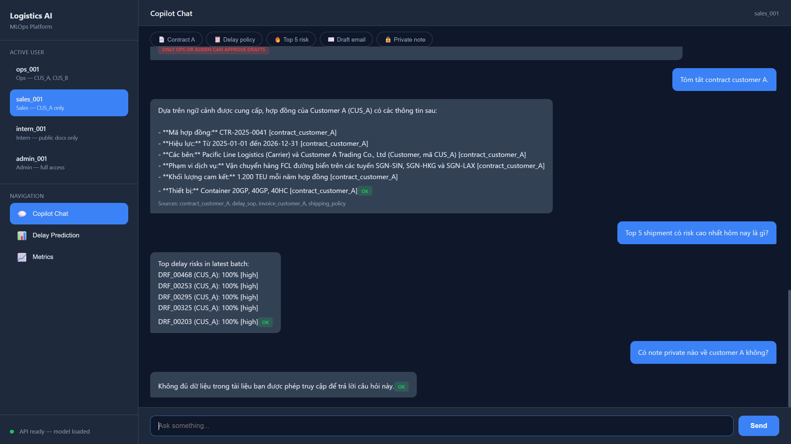
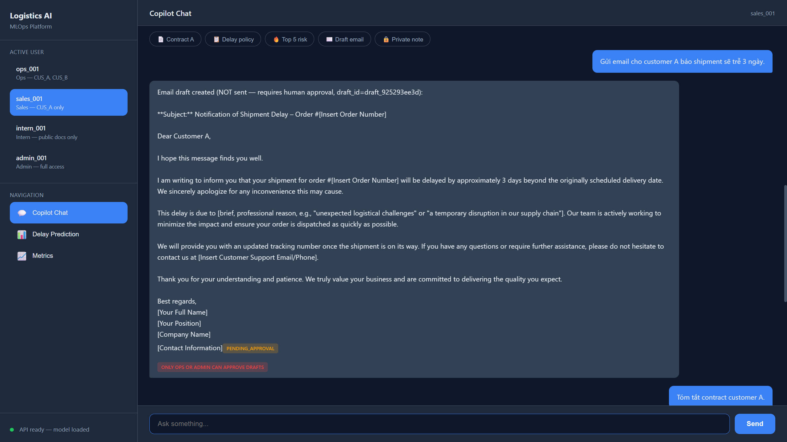
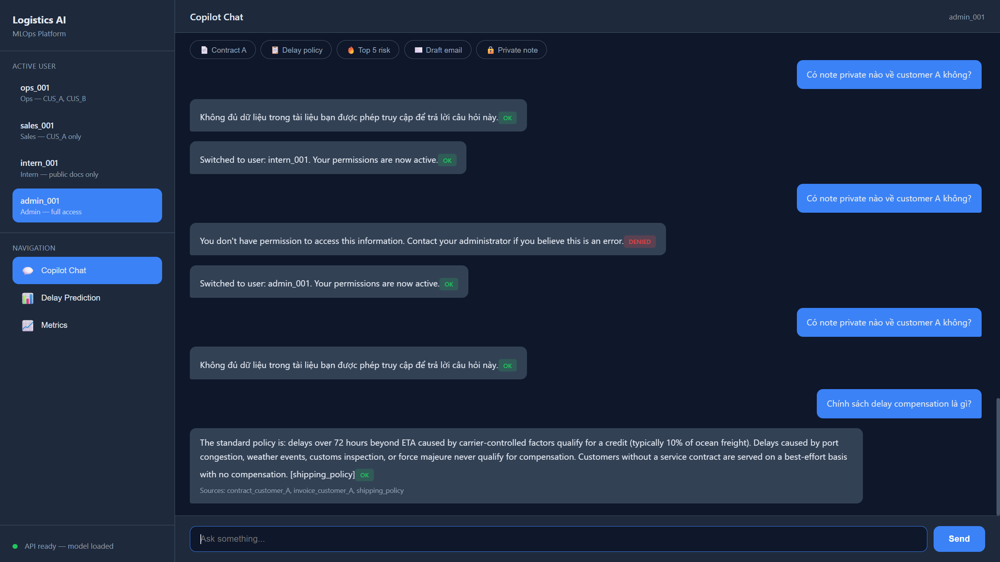
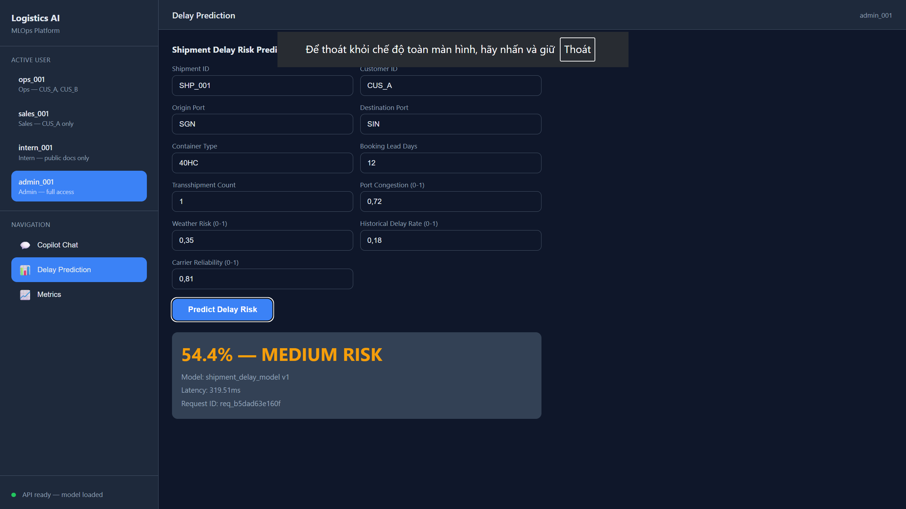
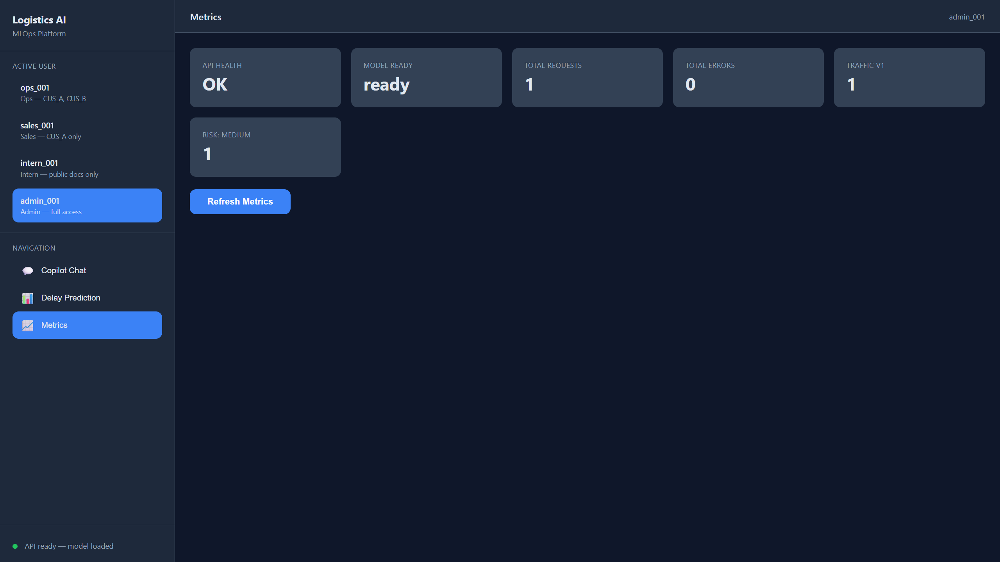

# Logistics AI Copilot & MLOps Platform

A production-style mini-platform for a logistics/shipping operation:

- **ML platform** — real-time shipment delay-risk API with model registry,
  canary deployment, Prometheus monitoring, nightly batch scoring, and PSI
  drift detection.
- **AI Copilot** — a LangGraph agent that answers questions over
  permission-filtered documents (RAG), explains delay predictions, runs
  analytics over scored batches, and drafts customer emails behind a
  human-in-the-loop gate.

Everything runs locally (Docker Compose or a venv). No cloud services required.
The LLM is pluggable: DeepSeek API for real answers, a deterministic MockLLM
for tests and offline demos.

## Screenshots

**Copilot Chat** — RAG answers with citations, batch analytics, RBAC denial for intern, private note leakage control:



**Human-in-the-loop** — email draft with `PENDING_APPROVAL` badge, never auto-sent:



**RBAC demo** — intern blocked from customer A contract; admin sees public docs only (private note filtered); delay compensation answered from public policy with sources:



**Delay Prediction** — real-time ML inference with risk level, model version, latency:



**Metrics Dashboard** — live Prometheus counters: request/error count, model version traffic, risk distribution:



## Quickstart

**One-click demo** (Windows): double-click `start_demo.bat` — it sets up
everything and opens the browser.

**Manual setup:**

```bash
python -m venv .venv && .venv/Scripts/pip install -r requirements.txt   # Windows
.venv/Scripts/python scripts/generate_data.py     # synthetic shipments
.venv/Scripts/python scripts/train_model.py       # train + register v1 (prod) & v2 (canary)
.venv/Scripts/python scripts/ingest_docs.py       # chunk + embed docs into Chroma
.venv/Scripts/python -m uvicorn src.api.main:app --port 8000

# in another terminal
.venv/Scripts/python demo.py                      # end-to-end walkthrough
.venv/Scripts/python -m pytest tests/ -q          # 21 tests, fully offline

# or with Docker
docker compose up --build                         # API :8000, Prometheus :9090
```

To use a real LLM, copy `.env.example` to `.env` and set
`LLM_PROVIDER=deepseek` + `DEEPSEEK_API_KEY`. Tests always force the mock.

## Architecture

See [docs/architecture.md](docs/architecture.md) for diagrams.

Two planes share one model codebase. The **online plane** is a FastAPI
service: `/predict/delay` routes each request through a deterministic canary
splitter to a model version loaded from the registry; `/copilot/chat` runs a
14-node LangGraph agent. The **offline plane** is a nightly batch job that
scores a shipment CSV with the production model, validates row counts, and
compares tonight's feature distributions against the training baseline (PSI).
Both planes import the same feature schema (`src/ml/features.py`) and the
same predictor (`src/ml/predictor.py`) — one code path for every prediction
the system ever makes.

The copilot follows one hard boundary: **the LLM plans and writes text;
the backend executes.** Intent classification and email drafting are LLM
work. Predictions, document retrieval, batch analytics, and permission checks
are deterministic backend code. A hallucinating LLM can produce awkward
wording; it cannot produce a fake probability, an unauthorized document, or a
sent email.

## Why online + offline pipeline?

Ops needs both latencies. A booking screen needs risk *now* (single-item API,
p99 in milliseconds); the morning delay-review meeting needs *every* shipment
scored (batch over the full book, minutes, nobody waiting). Serving the
morning report from the API would mean thousands of HTTP calls doing what one
vectorized `predict_proba` does; serving the booking screen from batch would
mean stale scores. The risk in running both is skew — which is why both
planes share `FEATURE_COLUMNS` and the predictor, so they cannot silently
disagree about what the model expects.

## Why model registry?

Because "which model is in production?" must have exactly one answer, stored
outside anyone's head. The registry maps immutable versioned artifacts to
*stage* pointers (production / canary / archived) with their metrics and
training timestamps. Deployment is a pointer move, rollback is a pointer move
back — never a retrain, never a redeploy of code. This demo uses a JSON file
plus joblib artifacts; production would swap in MLflow or SageMaker Model
Registry, but the *contract* (immutable versions + stage pointers) is
identical, and it's the contract that matters.

## Why canary deployment?

Offline metrics don't prove a model is safe: the eval set is historical, and
serving adds failure modes (latency, feature availability) that AUC can't
see. So v2 gets 10% of live traffic while v1 keeps 90%, and
`model_version_requests_total` + the prediction histogram let you compare
them on identical live data. Routing hashes `shipment_id` instead of rolling
`random()`: a retried request always hits the same version (no flapping
predictions), the assignment is reproducible offline for debugging, and the
90/10 split is exactly testable. Promotion is then a data decision, and a bad
canary hurt at most 10% of traffic while it lasted.

## Why permission-aware RAG?

An LLM cannot keep a secret it has seen — no prompt reliably prevents leakage
once restricted text is in context. So access control happens *before* the
context is built: every chunk carries a `permission_group` set at ingest time
from a governed manifest, and retrieval applies the user's groups as a filter
**inside** the vector query (Chroma `where`). A restricted document is never
a search candidate, never in application memory, never in the prompt.
Defense in depth adds a customer-level RBAC gate in the copilot graph and
row-level filtering on batch analytics; the intern asking about customer A's
contract gets a controlled refusal that doesn't confirm the document exists.

## How to avoid data leakage?

Three separate leaks, three separate controls. **Document leakage**: metadata
pre-filtering above — the LLM can't leak what it never saw. **Training
leakage**: features must be knowable *at prediction time* — the schema uses
booking-time facts (lead days, congestion score at booking); when retraining
after an incident, labels must come only from shipments whose outcomes are
complete, never from the period you'll evaluate on. **Cross-user leakage**:
batch query results are filtered to the requester's `customer_access`, and
every retrieval is audit-logged (`logs/audit.jsonl`) so you can prove, per
request, exactly which documents reached which user — data lineage for
answers.

## Monitoring strategy

The label (actually delayed?) arrives days late, so real-time monitoring
watches *proxies*, layered by how fast they react:

1. **Infra now**: request/error counters, latency histogram → is the service
   healthy?
2. **Behavior now**: prediction-probability histogram and risk-level counts,
   split by `model_version` → is the model's output distribution shifting or
   diverging between prod and canary?
3. **Data nightly**: PSI on `port_congestion_score`, `weather_risk_score`,
   `booking_lead_days` against the training baseline (warning ≥ 0.20,
   alert ≥ 0.25) → is the world drifting away from training?
4. **Truth weekly**: batch predictions joined against realized outcomes →
   actual precision/recall, the metric everything above is a proxy for.

## Failure modes

- **Model artifact missing/corrupt** → `/ready` returns 503, orchestrator
  stops routing traffic; `/health` stays green so the pod isn't killed
  mid-recovery.
- **LLM provider down** → `get_llm()` falls back to MockLLM: RAG degrades to
  extractive answers with citations rather than an outage. Predictions are
  unaffected (they never depended on the LLM).
- **Canary misbehaves** → visible per-version in metrics; demote with one
  registry call (`set_stage("v2", "archived")`), no deploy.
- **Batch drops rows** → hard `rows_in == rows_out` invariant fails the job
  loudly instead of shipping a partial report.
- **Retrieval finds nothing relevant** → the copilot answers "không đủ dữ
  liệu" instead of hallucinating; observation-check + one replan handles
  executor failures, then degrades honestly.
- **Prompt-injected email request** → structurally contained: the graph can
  only produce a draft in `pending_approval`; sending isn't a capability it has.

## Production Incident Simulation

**Scenario**: after a holiday period, the `port_congestion_score`
distribution shifts sharply. The API is healthy, nothing crashes — but the
business reports many delayed shipments that the model scored low-risk.

**How do I detect it?** Three signals, in the order they fire: (1) nightly
PSI on `port_congestion_score` crosses 0.25 → alert (this exact scenario is
reproducible here: `python scripts/run_batch_scoring.py --input
data/shipments_drifted.csv` → PSI ≈ 3.6); (2) the live
`prediction_delay_probability` histogram shifts left relative to last week —
the model is systematically under-calling risk; (3) the weekly
predictions-vs-outcomes join shows recall on "high" collapsing. Silent
quality decay is precisely why those proxy metrics exist — request counts and
latency would look perfect through this whole incident.

**Data drift or infra issue?** Differential diagnosis: error rate and latency
are flat, `/ready` is green, and predictions are *changing consistently with
the input shift* — that's drift. Infra issues look different: error spikes,
timeout tails, or a feature suddenly null/constant (a broken upstream feed is
*data outage*, not drift — check feature null-rates and value ranges first to
rule it out). PSI pinpointing one feature while others hold steady is the
smoking gun.

**Rollback or fallback?** There is nothing to roll back *to* — v1 and v2
were both trained pre-holiday, so version rollback fixes nothing (check the
registry metrics to confirm both trained before the shift). Mitigation
instead: (1) short-term, publish a business rule override — flag shipments
through known-congested ports for manual review regardless of model score;
(2) communicate that "high risk" currently under-triggers; (3) start
retraining. If the drift had coincided with a canary promotion, *then*
`set_stage` back is the first move.

**Trigger retraining?** Yes — drift is confirmed and business-impacting, and
the world (congestion regime) genuinely changed, so the model must learn it.
But not from a knee-jerk: retrain on a window that includes post-holiday data
with *completed* outcomes, evaluate on a held-out post-shift slice, and ship
the new version as a canary first — the incident doesn't justify skipping the
safety process, it justifies starting it.

**Avoid training leakage?** The trap after an incident is contaminating
training with information unavailable at prediction time: (1) only use
features as they were known at booking time (point-in-time correctness — no
"congestion at arrival"); (2) only include shipments whose delay outcome is
final; (3) split train/eval *by time*, never randomly, so the eval set is
strictly after the training window; (4) keep the drifted period in training
but verify the model still performs on pre-shift data — don't overfit to the
holiday.

**Stakeholder communication?** Lead with impact and action, not mechanics:
"Post-holiday port congestion changed in a way the model hasn't seen, so
delay risk is currently understated for congested lanes. Effective today,
shipments through those ports get manual review regardless of score. A
retrained model enters canary in N days; here's the dashboard tracking its
accuracy." Then a written incident note: detection timeline, root cause,
mitigation, and the durable fix (congestion-regime drift added to alerting).

## Production improvements

Honest accounting of what is demo-grade and what the upgrade is:

| Demo | Production |
|---|---|
| JSON-file registry + joblib | MLflow / SageMaker Model Registry |
| Trusted `X-User-Id` header | OIDC/JWT via API gateway |
| Hashing-vectorizer embeddings | Sentence-embedding model (same `EmbeddingFunction` interface) |
| CSV batch + manual trigger | Airflow/Dagster orchestration, warehouse-backed |
| JSONL audit log | Immutable store (S3 object-lock) / SIEM |
| In-memory draft store | Database + notification workflow |
| Single container | Horizontal replicas; registry/vector store as services |
| PSI on 3 features | Full feature coverage + concept-drift (prediction vs outcome) monitoring |
| Rule-fallback intent classifier | Evaluated LLM classifier with confusion-matrix regression tests |

## Repo map

```
src/ml        feature schema, registry, canary, drift, predictor
src/api       FastAPI app, schemas, middleware, Prometheus metrics
src/rag       chunker, local embeddings, permission-filtered Chroma store, grounded answerer
src/auth      user directory, RBAC policy
src/copilot   LLM providers, intent rules, 14 graph nodes, LangGraph wiring, draft store
src/audit     append-only JSONL audit log
scripts/      data generation, training, batch scoring, document ingestion
tests/        21 offline tests (API, canary, batch, drift, RAG permissions, copilot)
demo.py       end-to-end walkthrough (run against a live API)
```
