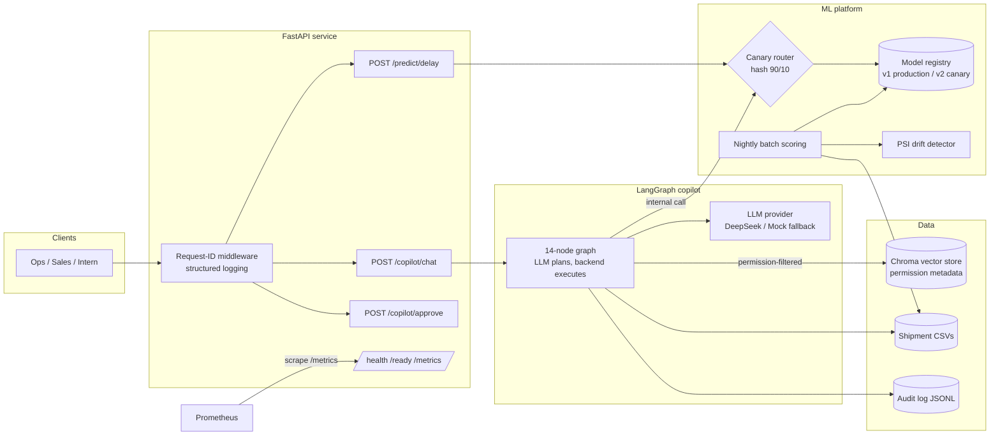
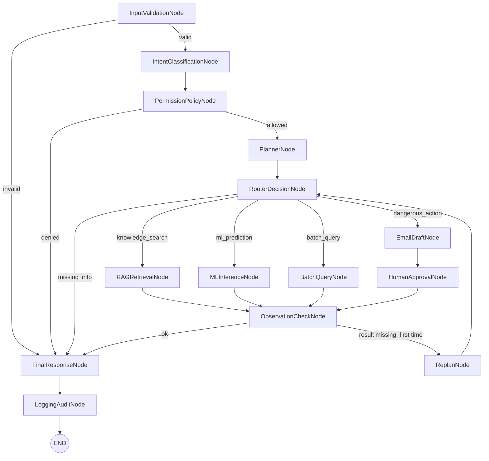

# Architecture

## System overview

## Copilot graph

## Request lifecycles

**Real-time prediction**: request → Pydantic validation → canary router picks
v1 (90%) or v2 (10%) by hashing `shipment_id` → model from registry →
response with `model_version`, `latency_ms`, `request_id` → Prometheus
counters/histograms updated.

**Copilot question**: request + `X-User-Id` → validate → LLM classifies
intent (rule fallback) → customer-level RBAC gate → planner/router → executor
(retrieval is permission-filtered *inside* the vector query; predictions come
from the same predictor as the API; batch answers are row-level filtered) →
observation check with one replan → response with citations → audit entry.

**Dangerous action**: email is drafted by the LLM, stored as
`pending_approval`, and returned to the user. Nothing is ever sent by the
graph. Approval requires an ops/admin user on a separate endpoint, and even
approval only flips the draft's status — dispatch is out of scope by design.
